# MoCA-Video: Motion-aware Concept Alignment for Video

<div align="center">

<p>
🚀 Training-free &nbsp;&nbsp;&nbsp;&nbsp; 🎨 Semantic Mixing
</p>

</div>

---

## 📽️ Teaser  
<!-- insert teaser GIF or static images here -->
[](assets/illustration/teaser.pdf)
---

## 🎥 Video Results

### Qualitative Results

<div align="center">
<table>
<tr>
<td colspan="3"><b>Mouse mixed with Cat</b></td>
</tr>
<tr>
<td>
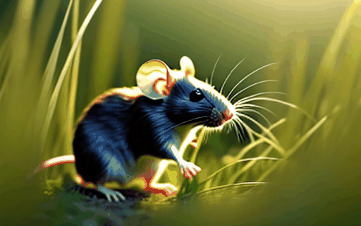
<p>Input Video</p>
</td>
<td>
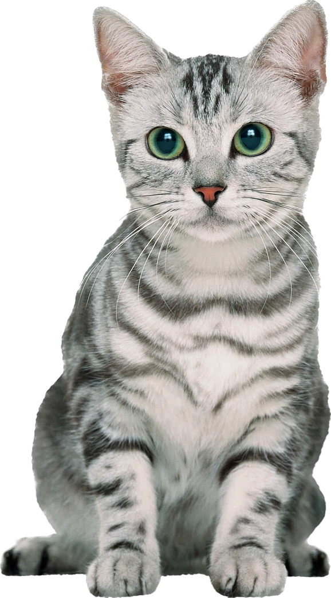
<p>Input Image</p>
</td>
<td>

<p>Output Video</p>
</td>
</tr>

<tr>
<td colspan="3"><b>Cow mixed with Sheep</b></td>
</tr>
<tr>
<td>
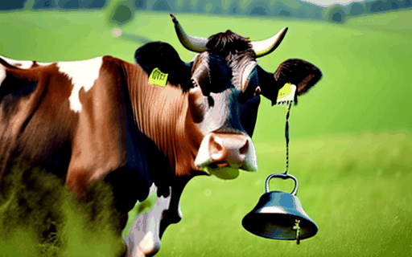
<p>Input Video</p>
</td>
<td>
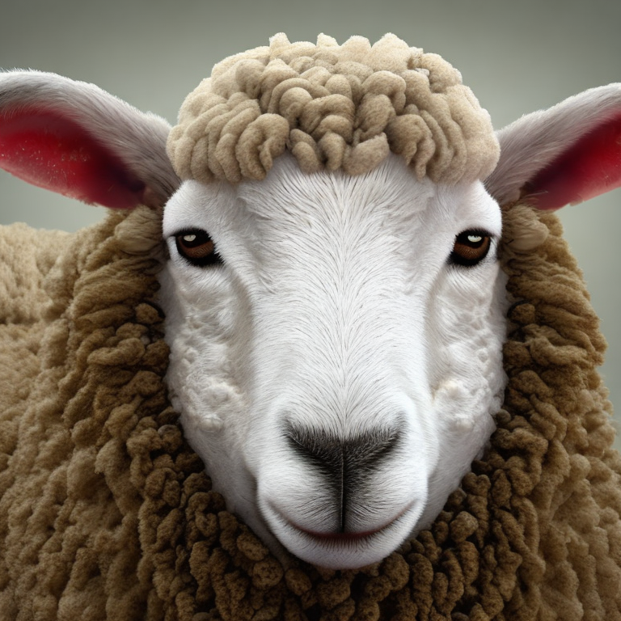
<p>Input Image</p>
</td>
<td>
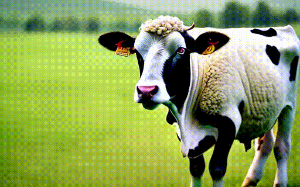
<p>Output Video</p>
</td>
</tr>

<tr>
<td colspan="3"><b>Bird mixed with Cat</b></td>
</tr>
<tr>
<td>

<p>Input Video</p>
</td>
<td>

<p>Input Image</p>
</td>
<td>
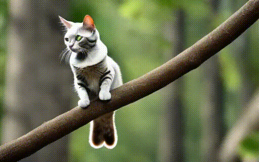
<p>Output Video</p>
</td>
</tr>

<tr>
<td colspan="3"><b>Horse mixed with Unicorn</b></td>
</tr>
<tr>
<td>
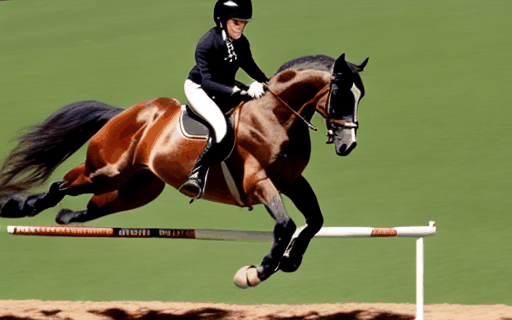
<p>Input Video</p>
</td>
<td>
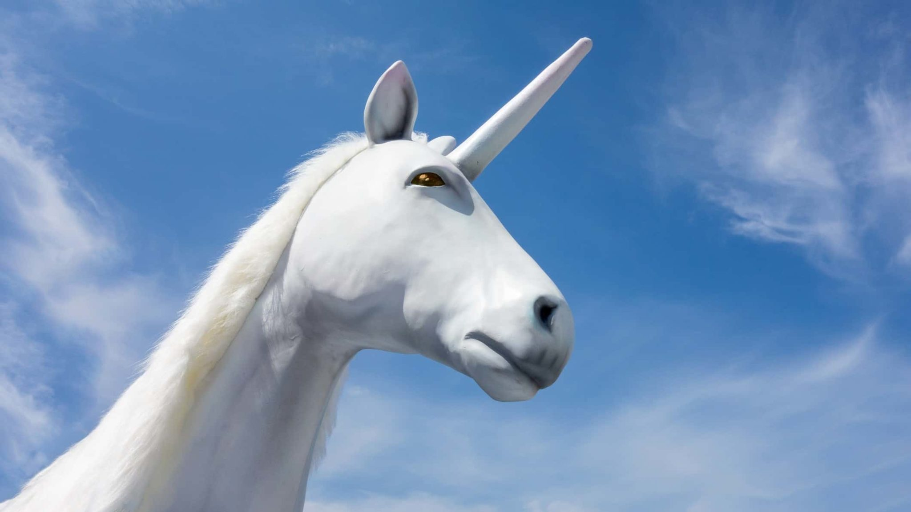
<p>Input Image</p>
</td>
<td>
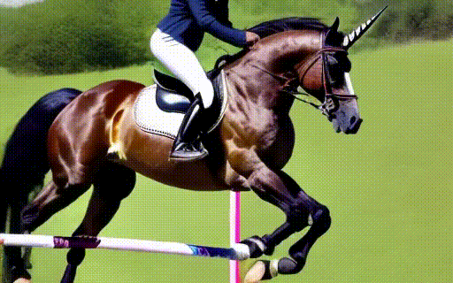
<p>Output Video</p>
</td>
</tr>

<tr>
<td colspan="3"><b>Surfer mixed with Kayak</b></td>
</tr>
<tr>
<td>
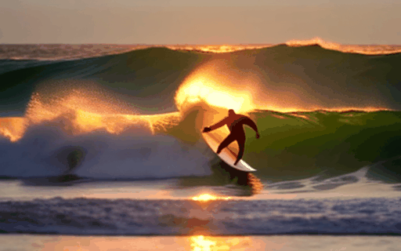
<p>Input Video</p>
</td>
<td>

<p>Input Image</p>
</td>
<td>

<p>Output Video</p>
</td>
</tr>

<tr>
<td colspan="3"><b>Astronaut mixed with Cat</b></td>
</tr>
<tr>
<td>

<p>Input Video</p>
</td>
<td>

<p>Input Image</p>
</td>
<td>

<p>Output Video</p>
</td>
</tr>
</table>
</div>

### Quantitative Results

Our method achieves superior performance across multiple metrics both quantatively and qualitatively:

<div align="center">
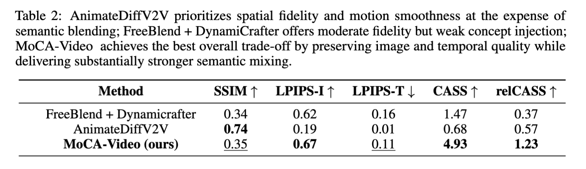
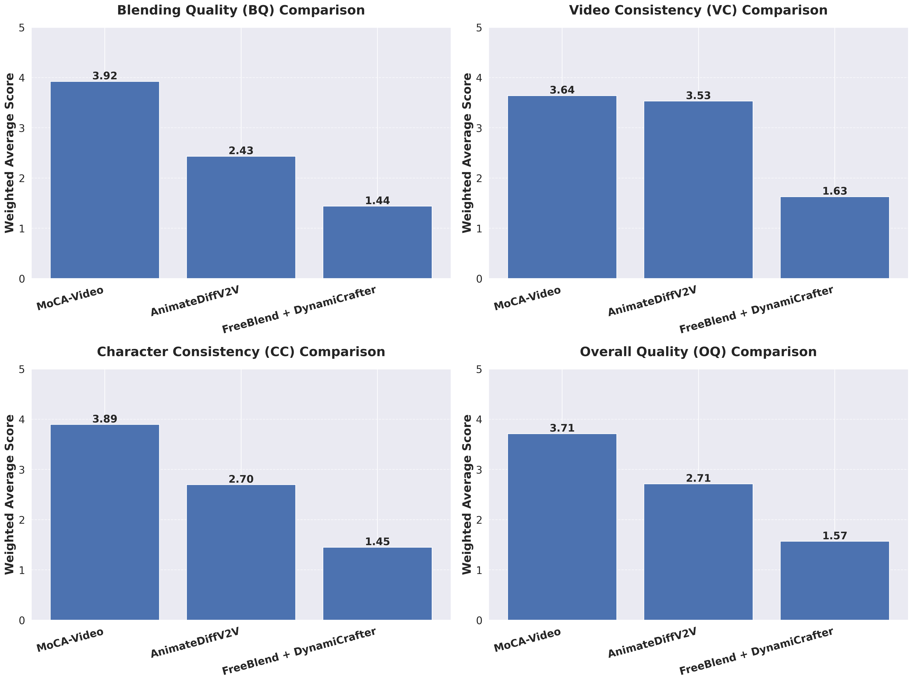
</div>

---

## 🚀 Quick Start

### 1. Clone This Repository  

```bash
git clone https://github.com/your-username/MoCA-Video.git
cd MoCA-Video
```

### 2. Environment Setup

```bash
# Create and activate conda environment
conda create -n moca python=3.10
conda activate moca

# Install dependencies
pip install -r requirements.txt
```

### 3. Download Pre-trained Models

Download the required pre-trained models and place them in the `checkpoints` directory:

```bash
mkdir -p checkpoints
# Download models from the provided links below
# Place them in the checkpoints directory
```

### 4. Run Inference

To run inference on your own videos:
```bash
python videocrafter_main.py \
```

The model can be run on a single NVIDIA V100 GPU with 32GB memory.

Thank for the community contrinutors for the code base:
[VideoCrafter Codebase](https://github.com/AILab-CVC/VideoCrafter) 
[Baseline FreeBlend Repo](https://github.com/WiserZhou/FreeBlend) 
[Metrics Repo](https://github.com/JunyaoHu/common_metrics_on_video_quality)
[FIFO Diffusion Pipeline](https://github.com/jjihwan/FIFO-Diffusion_public)
[Grounded-SAM-2](https://github.com/IDEA-Research/Grounded-SAM-2)
[AnimateDiffV2V Pipeline](https://huggingface.co/docs/diffusers/en/api/pipelines/animatediff#animatediffvideotovideopipeline)

## 📝 Citation

If you find our work useful for your research, please cite our paper:

```bibtex
@misc{zhang2025motionawareconceptalignmentconsistent,
      title={Motion-Aware Concept Alignment for Consistent Video Editing}, 
      author={Tong Zhang and Juan C Leon Alcazar and Bernard Ghanem},
      year={2025},
      eprint={2506.01004},
      archivePrefix={arXiv},
      primaryClass={cs.CV},
      url={https://arxiv.org/abs/2506.01004}
}
```

