# MoCA-Video: Motion-aware Concept Alignment for Video

<div align="center">

<p>
🚀 Training-free &nbsp;&nbsp;&nbsp;&nbsp; 🎨 Semantic Mixing
</p>

</div>

---

## 📽️ Teaser  
<!-- insert teaser GIF or static images here -->
[](assets/illustration/teaser.pdf)
---

## 🎥 Video Results

### Qualitative Results

<div align="center">
<table>
<tr>
<td colspan="3"><b>Mouse mixed with Cat</b></td>
</tr>
<tr>
<td>
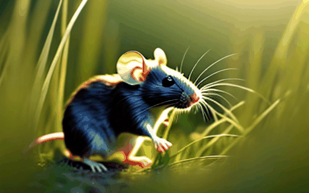
<p>Input Video</p>
</td>
<td>
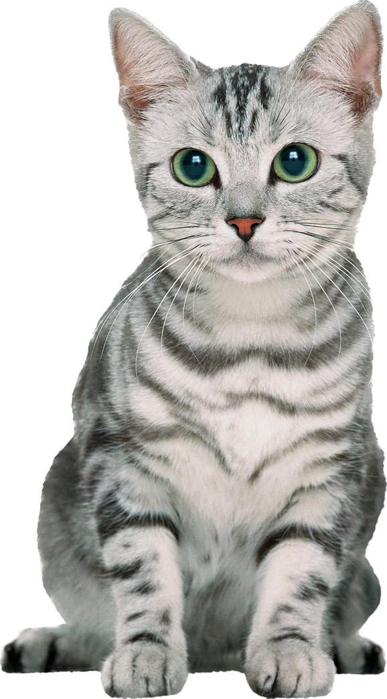
<p>Input Image</p>
</td>
<td>
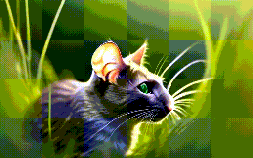
<p>Output Video</p>
</td>
</tr>

<tr>
<td colspan="3"><b>Cow mixed with Sheep</b></td>
</tr>
<tr>
<td>
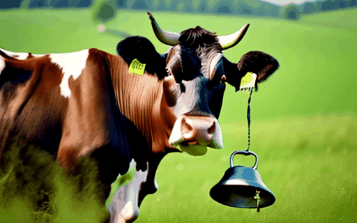
<p>Input Video</p>
</td>
<td>
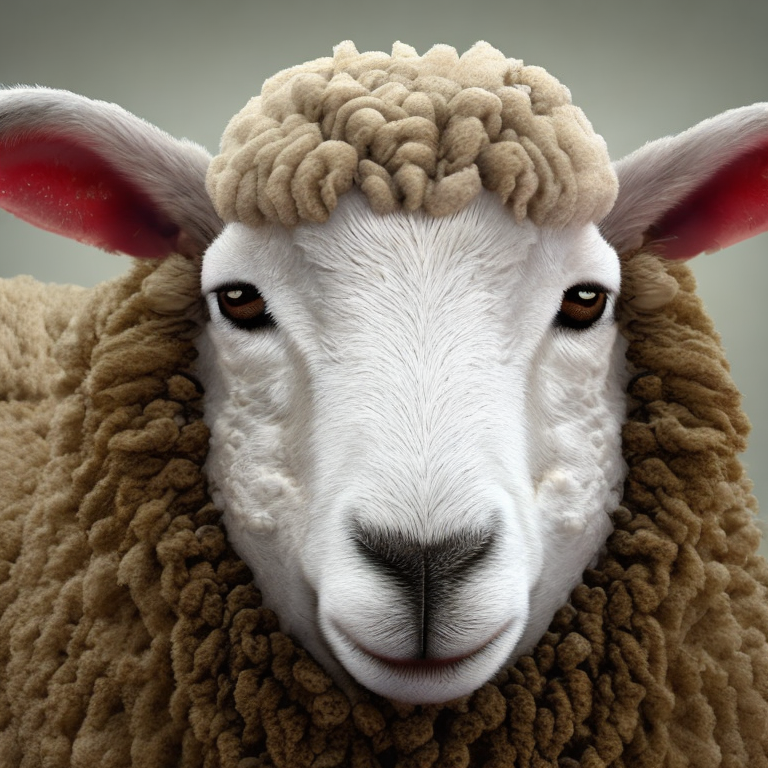
<p>Input Image</p>
</td>
<td>
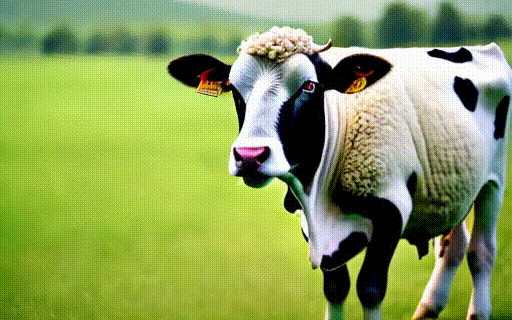
<p>Output Video</p>
</td>
</tr>

<tr>
<td colspan="3"><b>Bird mixed with Cat</b></td>
</tr>
<tr>
<td>
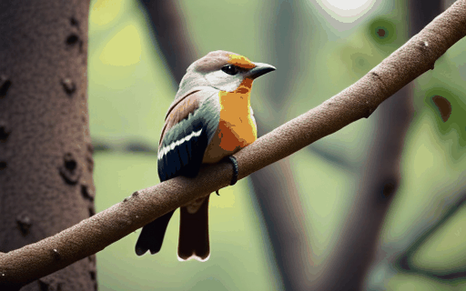
<p>Input Video</p>
</td>
<td>

<p>Input Image</p>
</td>
<td>

<p>Output Video</p>
</td>
</tr>

<tr>
<td colspan="3"><b>Horse mixed with Unicorn</b></td>
</tr>
<tr>
<td>
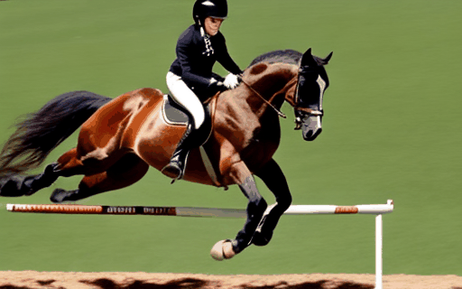
<p>Input Video</p>
</td>
<td>
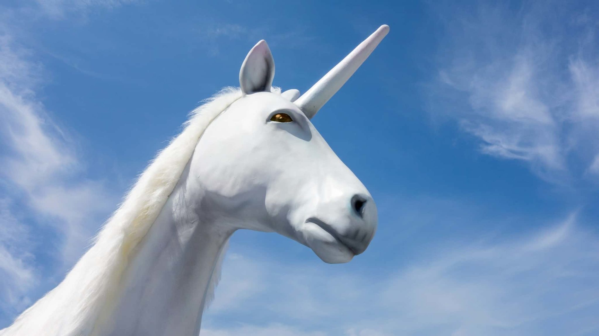
<p>Input Image</p>
</td>
<td>
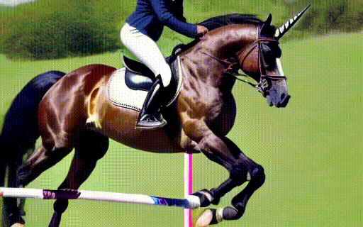
<p>Output Video</p>
</td>
</tr>

<tr>
<td colspan="3"><b>Surfer mixed with Kayak</b></td>
</tr>
<tr>
<td>
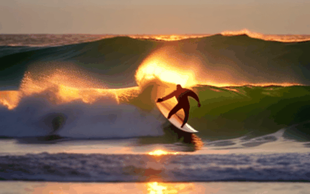
<p>Input Video</p>
</td>
<td>

<p>Input Image</p>
</td>
<td>

<p>Output Video</p>
</td>
</tr>

<tr>
<td colspan="3"><b>Astronaut mixed with Cat</b></td>
</tr>
<tr>
<td>

<p>Input Video</p>
</td>
<td>

<p>Input Image</p>
</td>
<td>

<p>Output Video</p>
</td>
</tr>
</table>
</div>

### Quantitative Results

Quantitative results reported in the paper:

<div align="center">
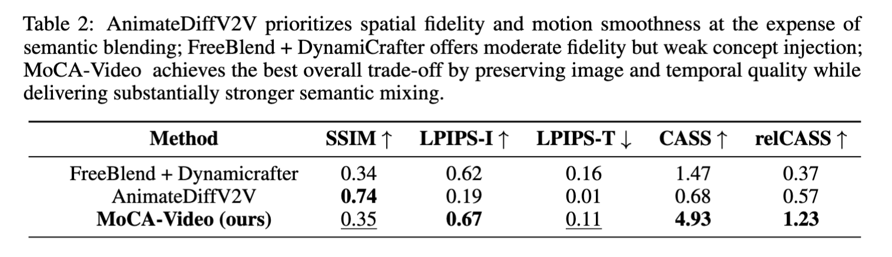

</div>

---

## Method and code

MoCA-Video uses a frozen VideoCrafter2 text-to-video model. A source prompt defines the base motion and scene. Cross-attention to the named source object produces a spatial mask; a VAE-encoded reference image is injected into the predicted clean latent inside that mask at low-noise steps. A bounded momentum correction carries the edited prediction across frames. The implementation corresponds to the companion paper, *MoCA-Video: Motion-Aware Concept Alignment for Video Semantic Mixing*.

The maintained inference path is `concept_attention`. The earlier external segmentation / SAM experiment has been retired and is not required for inference.

## Run inference

1. Clone this repository and create a Python 3.10 environment:

   ```bash
   git clone https://github.com/ZhangT-tech/MoCA-Video.git
   cd MoCA-Video
   conda create -n moca-video python=3.10 -y
   conda activate moca-video
   ```

2. Install a CUDA-compatible PyTorch and torchvision pair for your machine, following the [official PyTorch selector](https://pytorch.org/get-started/locally/). The paper uses CUDA 11.8 and A100 GPUs. Install the inference dependencies:

   ```bash
   python -m pip install -r requirements-inference.txt
   ```

   `requirements.txt` is the archived Ibex environment freeze and contains machine-specific package paths. Use `requirements-inference.txt` for a new environment.

3. Obtain the [VideoCrafter2 512×320 text-to-video checkpoint](https://github.com/AILab-CVC/VideoCrafter) and place it at `videocrafter_models/base_512_v2/model.ckpt`, or pass its location with `--ckpt_path`. The checked-in configuration is `configs/inference_t2v_512_v2.0.yaml`. The pretrained weights are not included in this repository.

4. Run the checked-in example from the repository root:

   ```bash
   python videocrafter_main.py \
     --prompt_file examples/astronaut_cat.csv \
     --prompt_index 0 \
     --experiment_condition concept_attention \
     --output_dir results/astronaut_cat \
     --use_fp16
   ```

   The example references `assets/results/cat.png` and writes `results/astronaut_cat/fifo.mp4`. The full default run generates a 100-frame FIFO sequence and needs substantial GPU memory and time. For an initial short run, add `--new_video_length 24 --video_length 8 --num_partitions 3`.

## Prompt format and options

The prompt CSV contains `prompt,conditioned_object,conditioned_image_path,conditioned_prompt,gamma`. `conditioned_object` must identify the source concept in the source prompt. `conditioned_image_path` points to the reference image; paths are resolved from the working directory. `conditioned_prompt` describes the reference concept. `prompt_index` is zero based.

The default concept-attention mask uses a relative threshold of `0.4`. Reference latent scale is `0.8` (`--enhancement_factor`); momentum decay is `0.9`, with absolute clamp `2.0` (`--momentum_clamp`); injection is active at diffusion timesteps ≤300. `--gamma_override` changes the residual noise strength from the CSV. Use `--conditioned_image_override` or `--conditioned_prompt_override` to try a different reference without editing the CSV. The `--disable_injection`, `--disable_mask`, and `--disable_cond_prompt` flags support the paper's ablations.

To inspect all options, run `python videocrafter_main.py --help`.

## Acknowledgments

This repository builds on [VideoCrafter](https://github.com/AILab-CVC/VideoCrafter), [FreeBlend](https://github.com/WiserZhou/FreeBlend), and [FIFO Diffusion](https://github.com/jjihwan/FIFO-Diffusion_public). Evaluation code draws on [common_metrics_on_video_quality](https://github.com/JunyaoHu/common_metrics_on_video_quality). Thanks to their authors and contributors.
